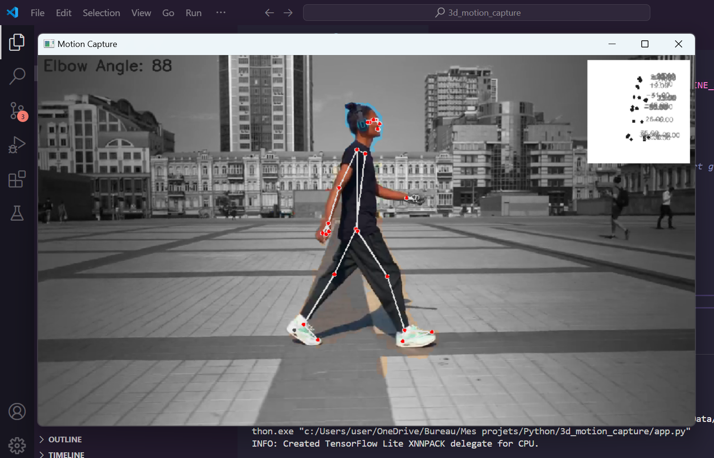

Realtime Person Motion Capture in video



## Overview
This project leverages Mediapipe and OpenCV to capture and analyze human poses in a video. It detects and visualizes 3D pose landmarks, displays an overlay box showing the 3D landmarks, and performs simple posture analysis. The OpenCV GUI window is resizable, making it flexible for various screen sizes.

## Features
- Pose detection using Mediapipe's Pose solution.
- Selfie segmentation to apply grayscale to the background.
- Overlay of 3D landmarks in a white box on the video frame.
- Calculation and display of the elbow angle.


## Requirements
- Python 3.6+
- OpenCV
- Mediapipe
- NumPy

````
pip install -r requirements.txt
````