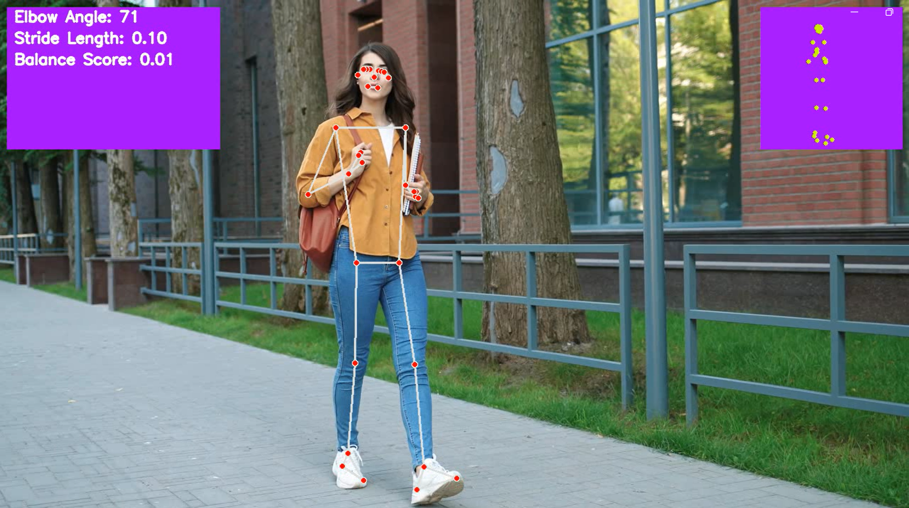

Realtime Human Motion Tracking and Analysis



## Overview
This project leverages Mediapipe and OpenCV to capture and analyze human poses in a video. It detects and visualizes 3D pose landmarks, displays an overlay box showing the 3D landmarks, and performs simple posture analysis. The OpenCV GUI window is resizable, making it flexible for various screen sizes.

## Features
- Pose detection using Mediapipe's Pose solution.
- Selfie segmentation to apply grayscale to the background.
- Overlay of 3D landmarks in a white box on the video frame.
- Elbow Angle : We calculate the elbow angle using the 3D coordinates of the shoulder, elbow, and wrist landmarks.
- Gait Analysis: We calculate the stride length by measuring the distance between the left and right heels.
- Balance Analysis: We calculate the center of mass (COM) of the body by taking the average of all landmark coordinates. Then, we measure the distance from the COM to the left and right ankles. The difference between these distances is used as a balance score, where a smaller value indicates better balance.


## Requirements
- Python
- OpenCV
- Mediapipe
- NumPy

```sh
pip install -r requirements.txt
```

## Run
```sh
python app.py
```